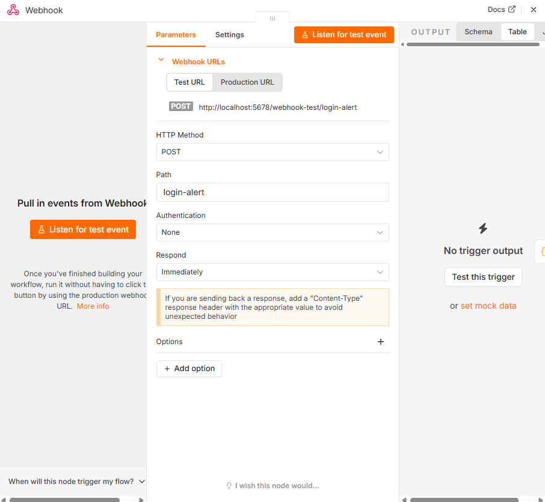
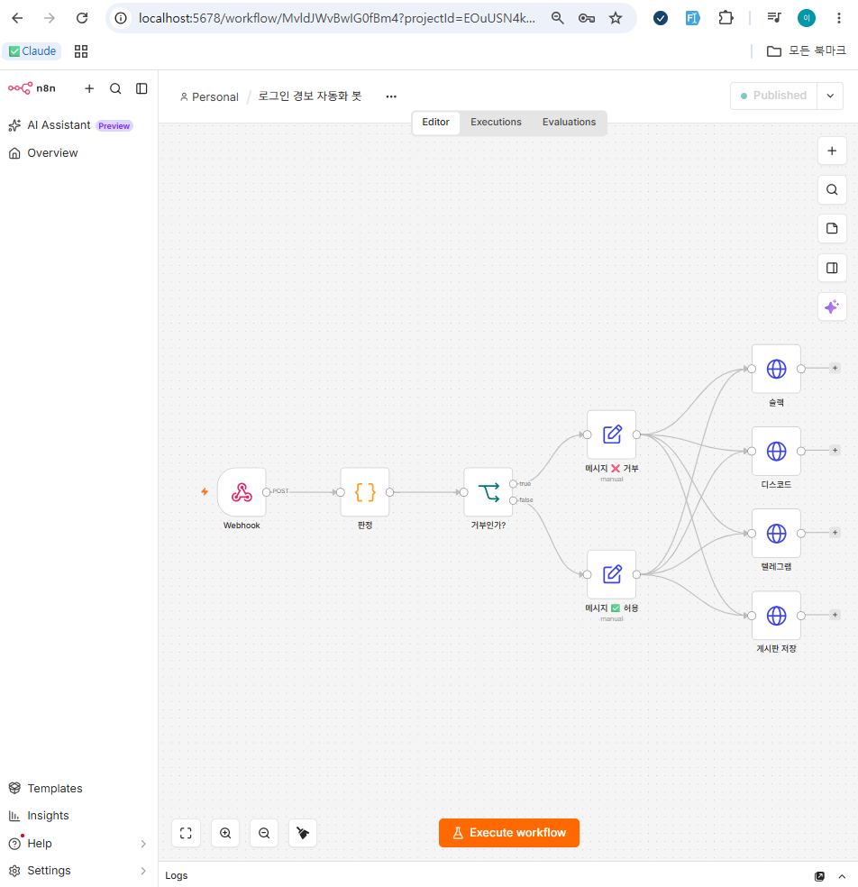
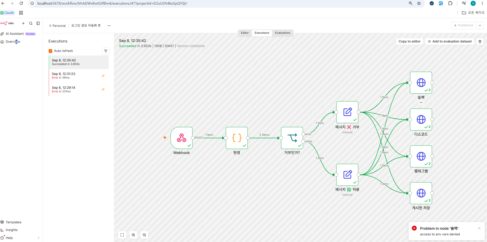
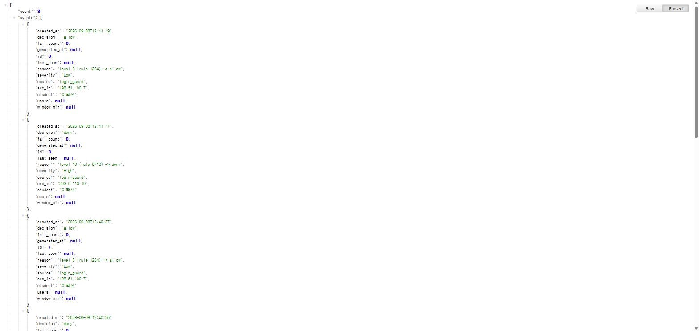
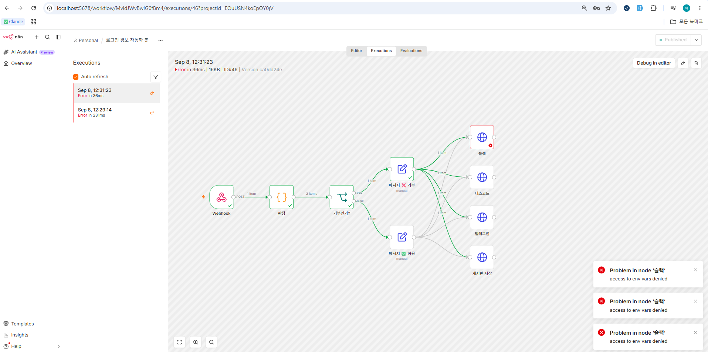

# 로그인 경보 자동화 봇

## ① 무엇을 만들었는지

로그인 시도 로그(레벨/규칙/IP)를 n8n으로 보내면, n8n이 레벨에 따라 **허용/거부**를 자동 판정하고 Slack·Discord·Telegram으로 알림을 보낸 뒤, 그 결과를 게시판 REST API를 통해 MySQL에 기록하는 자동화 봇입니다. 파이썬 전송기 → n8n 판정/분기/알림 → Flask API → MySQL까지 한 번에 이어지는 파이프라인입니다.

## ② 작업 내역

1. **`alert_sender.py`** — n8n Webhook으로 경보 JSON(`student`, `alerts[]`)을 POST하는 파이썬 스크립트 작성. n8n 주소는 `.env`에서 읽고, 전송 실패 시 예외 처리만 하고 프로그램은 계속 실행되도록 함.
2. **n8n 워크플로우** 구성 (`n8n_login_alert_workflow.json`):
   - `Webhook` → `판정`(Code, JavaScript) — alerts 배열을 1건씩 쪼개서 `level >= 10`이면 `High/deny`, `level >= 7`이면 `Medium/allow`, 나머지는 `Low/allow`로 판정
   - `거부인가?`(IF) — `decision === 'deny'` 로 분기
   - `메시지 ❌ 거부` / `메시지 ✅ 허용`(Set) — 사람이 읽을 메시지 문자열 조립 (원본 필드는 유지)
   - `슬랙` / `디스코드` / `텔레그램` / `게시판 저장`(HTTP Request) — 4곳에 동시 팬아웃
3. **`board_server`** (기존에 만들어둔 Flask 게시판 앱 `app.py`를 확장) — `POST /api/security/events`(X-API-Key 인증, 필드 검증), `GET /api/security/events?student=`(인증 없이 조회) 구현. 테이블 스키마는 `init.sql`로 별도 정리.
4. **MySQL**(Docker) + **n8n**(Docker) 로컬 환경에서 Webhook → 판정 → 알림 → DB 저장까지 실제로 실행해서 검증.

**사용한 것**: Python(Flask, SQLAlchemy, requests), n8n(Docker), MySQL(Docker), Slack/Discord/Telegram Webhook, Postman(테스트).

## ③ 기능 구현 화면

**Webhook 노드 설정** (Path, Method 등)



**n8n 워크플로우 전체 구조** (Webhook → 판정 → 거부인가 → 메시지 → 슬랙/디스코드/텔레그램/게시판 저장)



**실행 성공 화면** — 모든 노드 초록 체크, `게시판 저장`까지 정상 처리



**DB에 저장된 결과** (`GET /api/security/events?student=이학산`)



## ④ 실행 방법

1. MySQL 준비 — Docker로 띄우거나 로컬 MySQL 사용. `init.sql` 실행하거나, 그냥 `app.py`를 최초 실행하면 `db.create_all()`이 자동으로 `security_events` 테이블을 만듭니다.
2. `.env.example`을 복사해 `.env`로 만들고 본인 값 채우기 (`SECURITY_API_KEY`, `DATABASE_URL`, `N8N_WEBHOOK_URL`, `SLACK_WEBHOOK_URL`, `DISCORD_WEBHOOK_URL`, `TELEGRAM_BOT_TOKEN`, `TELEGRAM_CHAT_ID`, `BOARD_API_URL` 등).
3. 의존성 설치 후 `board_server`(app.py) 실행:
   ```bash
   pip install -r requirements.txt
   python app.py
   ```
   → `http://localhost:5000` 에서 응답하면 성공.
4. n8n 실행(Docker) 후, 브라우저로 접속해서 `n8n_login_alert_workflow.json`을 **Import from File**로 불러오기. `.env`의 값들이 워크플로우의 `{{$env["..."]}}` 표현식에서 인식되도록, n8n 컨테이너를 `--env-file .env` 옵션으로 띄우기.
5. 워크플로우 우측 상단 **Active** 토글 켜기.
6. `alert_sender.py` 실행:
   ```bash
   python alert_sender.py
   ```
   → `[전송 성공] status=200 ...` 출력되면 성공.
7. 확인:
   - n8n **Executions** 탭에서 방금 실행이 **Succeeded**로 뜨는지
   - Slack/Discord/Telegram에 🚫/✅ 메시지가 도착했는지
   - `http://localhost:5000/api/security/events?student=<본인이름>` 호출 시 방금 보낸 이벤트가 최신순으로 조회되는지

## ⑤ 막혔던 점과 해결 방법

1. **n8n이 `{{$env["..."]}}`를 다 빈 값으로 처리함** — 최신 n8n은 보안 정책상 노드 표현식에서 환경변수 접근을 기본 차단합니다(`access to env vars denied` 에러, 아래 스크린샷). `N8N_BLOCK_ENV_ACCESS_IN_NODE=false`를 컨테이너 환경변수로 추가하고 컨테이너를 재생성해서 해결했습니다. (같은 볼륨을 그대로 마운트했기 때문에 워크플로우/실행 이력은 그대로 유지됨)

   

2. **Docker n8n 컨테이너에 환경변수가 하나도 안 들어감** — `docker-compose.yml` 없이 `docker run`으로 띄운 컨테이너라 실행 중에는 값을 주입할 수 없었습니다. `docker stop/rm` 후 같은 볼륨(`n8n_data`)에 `--env-file .env` 옵션을 붙여 재생성하는 방식으로 해결했습니다.

3. **n8n(Docker 컨테이너)에서 로컬 `localhost:5000` Flask 서버 호출이 안 됨** — 컨테이너 안에서 `localhost`는 컨테이너 자기 자신을 가리켜서 호스트의 Flask 서버에 닿지 않습니다. `BOARD_API_URL`을 `http://host.docker.internal:5000/...`으로 바꿔서 해결했습니다.
